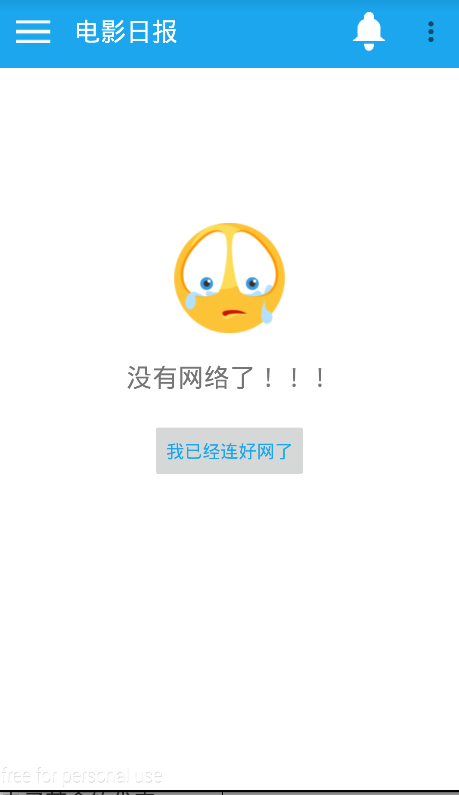
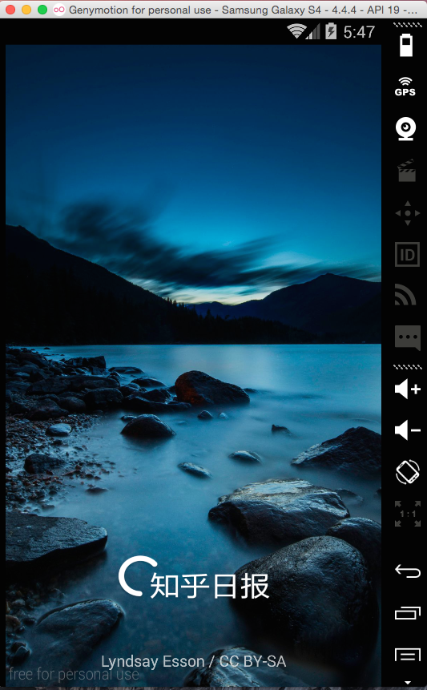
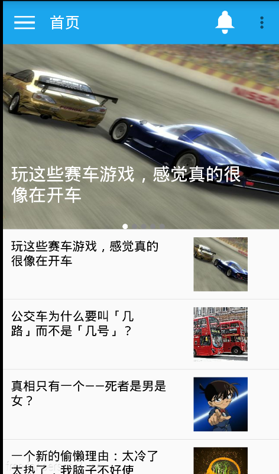
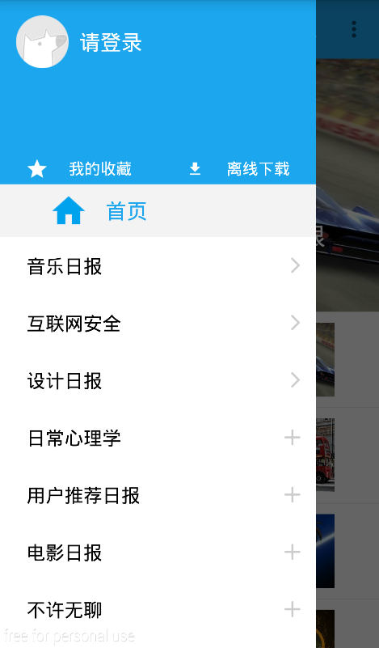
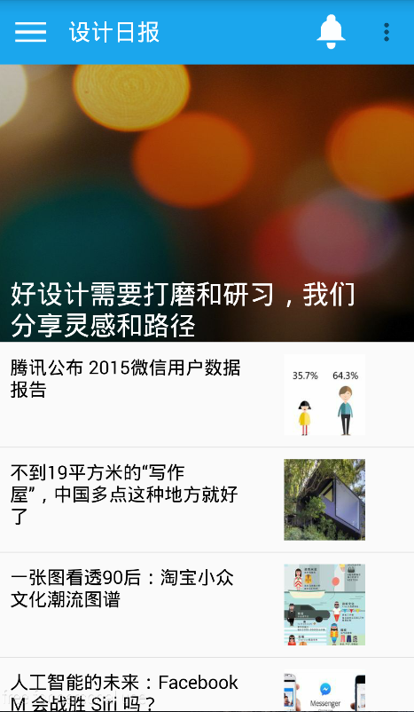
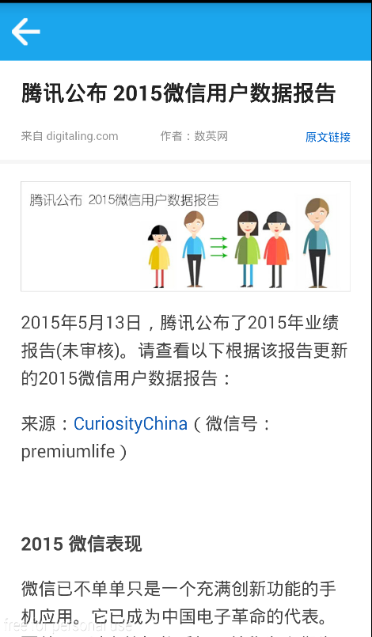

## 知乎日报思路分析        
##### 首页：
viewPager+分组的ListView+actionBar  

##### 各个主题日报:
SingleViewPager+LinearLayout+ListView+actionBar与首页的不一样    

#### #内容页：
LinearLayout+webView
###### 需要修正的bug
	√主页显示图片的问题--》个人感觉是图片或者图片加载算法的问题
	√主题日报与首页——》点击后背景颜色改变，显示正在观看的是什么类型
	侧拉菜单ListView上边的滑动同步问题
	√主题日报关注问题--》需存入数据库
	√排序--》关注一个主题日报的时候将他放在前边
	
####### 2015-9-1task
	√1.我的收藏也跳到登录界面。  
	√2.调一调显示日报的界面：字体小一些，margin大一些
	*3.日报显示界面图片加载问题，可以尝试加载图片替换成ImageLoader解决
	4.首页内容的展示 内容怎样得到？？
	5.下拉刷新
	6.日报内容阅读去掉actionBar 自己自己做一个标题栏
	7.离线下载
	
####### 2015-9-9log
	今天进行了功能级别的一次重构，为了减轻非常差的用户体验，增加了联网失败时候的页面，当设备没有接入wifi或者数据流量的时候，他会跳到联网失败的Fragment，效果图如下：
	
 
##### 目前效果如下：
#### 加载页

#### 首页

#### 菜单

#### 主题日报

#### 日报内容

